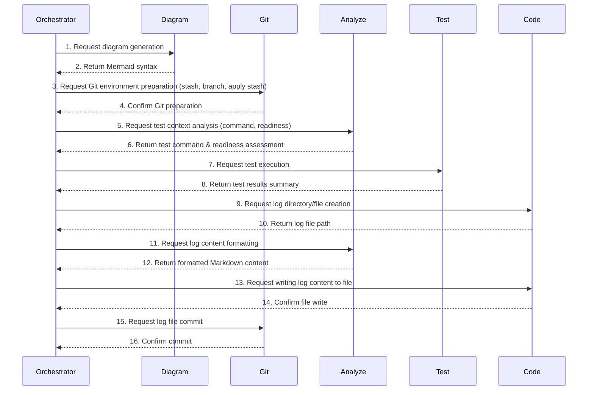

```mermaid
sequenceDiagram
    participant Orchestrator
    participant Diagram
    participant Git
    participant Analyze
    participant Test
    participant Code

    Orchestrator ->> Diagram: 1. Request diagram generation
    Diagram -->> Orchestrator: 2. Return Mermaid syntax

    Orchestrator ->> Git: 3. Request Git environment preparation (stash, branch, apply stash)
    Git -->> Orchestrator: 4. Confirm Git preparation

    Orchestrator ->> Analyze: 5. Request test context analysis (command, readiness)
    Analyze -->> Orchestrator: 6. Return test command & readiness assessment

    Orchestrator ->> Test: 7. Request test execution
    Test -->> Orchestrator: 8. Return test results summary

    Orchestrator ->> Code: 9. Request log directory/file creation
    Code -->> Orchestrator: 10. Return log file path

    Orchestrator ->> Analyze: 11. Request log content formatting
    Analyze -->> Orchestrator: 12. Return formatted Markdown content

    Orchestrator ->> Code: 13. Request writing log content to file
    Code -->> Orchestrator: 14. Confirm file write

    Orchestrator ->> Git: 15. Request log file commit
    Git -->> Orchestrator: 16. Confirm commit
```